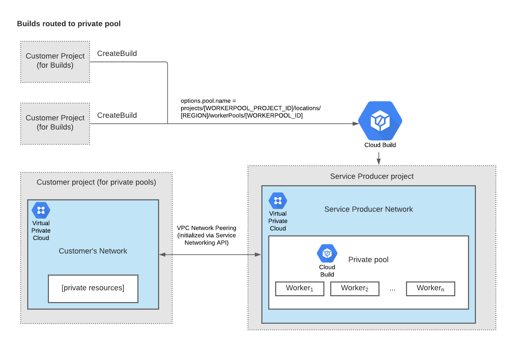

# gcp_CI_CD
- GCP Services Used:
    - CLoud Build
    - CLoud Run
    - Cloud Storage
    - Artifact registry


## Cloud build stage 
- Install dependencies & Run Unit tests ✅
- Build image  ✅
- Scan image with trivy ✅
- Push image to AR ✅
- Deploy to cloud run ✅
- Deploy to k8s [argocd or manual yaml ] TODO ⚒️
- Save Artifacts outputs to CloudStorage folder ✅


## Commands

```bash
docker build -t europe-west4-docker.pkg.dev/project-be3586ae-547c-413e-aac/warmup2first/fastapi_otp .
gcloud builds submit --tag europe-west4-docker.pkg.dev/project-be3586ae-547c-413e-aac/warmup2first/fastapi_otp

gcloud builds submit --region=europe-west4 --config cloudbuild.yaml
 gcloud builds submit \
  --region=europe-west4 \
  --service-account="projects/project-be3586ae-547c-413e-aac/serviceAccounts/macarious-cloudbuild-sa@project-be3586ae-547c-413e-aac.iam.gserviceaccount.com" \
  --config cloudbuild.yaml \
  .
```


```txt
todo: 
- waitfor
- parallel exec

ERROR: (gcloud.run.deploy) [macarious-cloudbuild-sa@project-be3586ae-547c-413e-aac.iam.gserviceaccount.com] does not have permission to access namespaces instance [project-be3586ae-547c-413e-aac] (or it may not exist): Permission 'iam.serviceaccounts.actAs' denied on service account 816487322531-compute@developer.gserviceaccount.com (or it may not exist). This command is authenticated as macarious-cloudbuild-sa@project-be3586ae-547c-413e-aac.iam.gserviceaccount.com which is the active account specified by the [core/account] property.

```

## Network & Private-WorkerPool



- Private pools are hosted in a Google-owned Virtual Private Cloud network called the `service producer network`. 
- We have 2 options:
    - use the service producer network
    - set up a private connection between the service producer network and the VPC network that contains your resources.
- Setup your VPC private connection to service producer network
    - ***Create VPC Connection Peering***
    - `Private service access tab` -> `Allocated IP ranges for services`
    - `Private service access tab` -> `Private connections to services`
    
## notes
- shared workspace folder root access problems
- Create your own worker pool and 

- bash value and sustitution values-> $$ and $
- cloud build override home dir of images